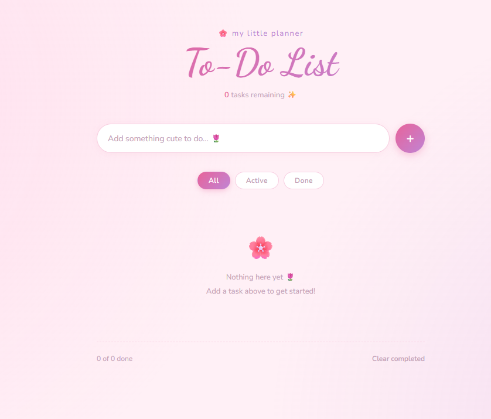

# 🌸 Taskly - Your Little Planner

A beautiful, minimal to-do list application with a cute aesthetic. Stay organized and productive with a delightful task management experience.



## ✨ Features

- **Add & Manage Tasks** - Quickly add new tasks with a beautiful input interface
- **Mark Complete** - Check off tasks as you complete them with smooth animations
- **Filter Tasks** - View all, active, or completed tasks with easy-to-use filter buttons
- **Task Counter** - See how many tasks remain and how many you've completed
- **Local Storage** - Your tasks are automatically saved to your browser's local storage
- **Clear Completed** - Easily remove all finished tasks at once
- **Responsive Design** - Works seamlessly on desktop and mobile devices
- **Smooth Animations** - Enjoy delightful transitions when interacting with tasks

## 🎨 Design

Taskly features a soft, pastel color scheme with:
- Beautiful gradient text for the main title
- Soft pink and purple background
- Smooth hover effects and transitions
- Cute emojis throughout the interface
- Responsive typography that adapts to screen size

## 🚀 Getting Started

### Prerequisites
- A modern web browser (Chrome, Firefox, Safari, Edge, etc.)

### Installation

1. Clone the repository:
```bash
git clone https://github.com/Bhumimahajan01/Taskly.git
cd Taskly
```

2. Open in your browser:
   - Simply double-click `index.html` 

## 📁 Project Structure

```
Taskly/
├── index.html      # Main HTML structure
├── style.css       # Styling and layout
├── index.js        # Task management logic
└── README.md       # Documentation
```

## 🎮 How to Use

1. **Add a Task**: Type your task in the input field and press Enter or click the "+" button
2. **Mark Complete**: Click the checkbox next to a task to mark it as done
3. **Delete a Task**: Click the "✕" button to remove a task
4. **Filter Tasks**: Use the filter buttons (All, Active, Done) to view specific tasks
5. **Clear Completed**: Click "Clear completed" to remove all finished tasks

## 💾 Data Persistence

All your tasks are automatically saved to your browser's local storage. They'll be there when you come back!

## 🛠️ Technologies Used

- **HTML5** - Semantic markup
- **CSS3** - Modern styling with gradients, flexbox, and animations
- **JavaScript (ES6+)** - Task management and DOM manipulation


## 🎯 Future Enhancements

- [ ] Add due dates to tasks
- [ ] Task categories/tags
- [ ] Dark mode toggle
- [ ] Export tasks to file
- [ ] Cloud sync option
- [ ] Task priorities

## 📝 License

This project is open source and available under the MIT License.

## 👨‍💻 Author

Created by [Bhumimahajan01](https://github.com/Bhumimahajan01)

## 🤝 Contributing

Contributions are welcome! Feel free to open an issue or submit a pull request.

---

**Enjoy planning your tasks with Taskly!** 🌷✨